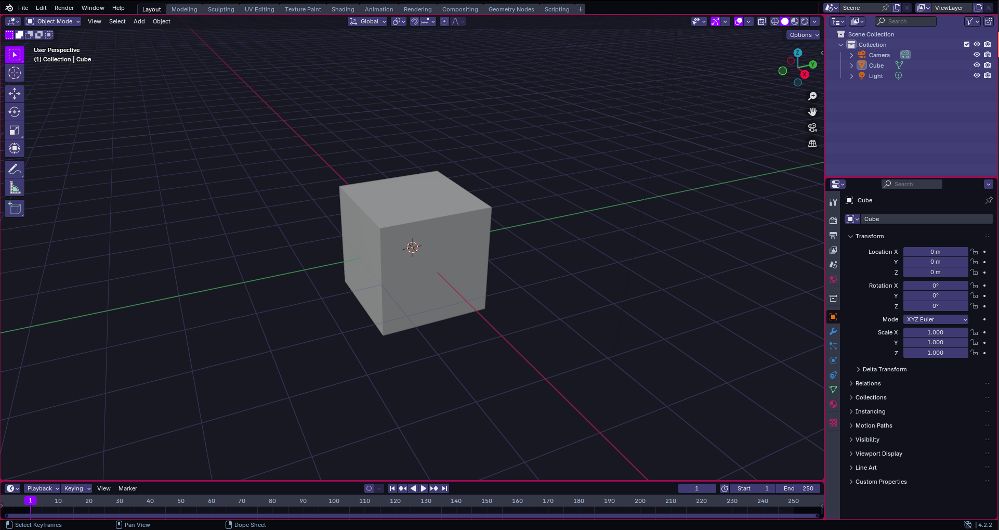
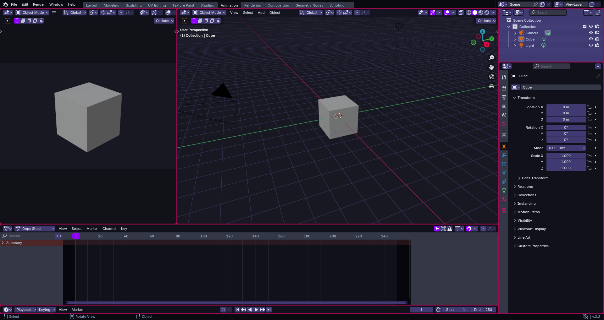
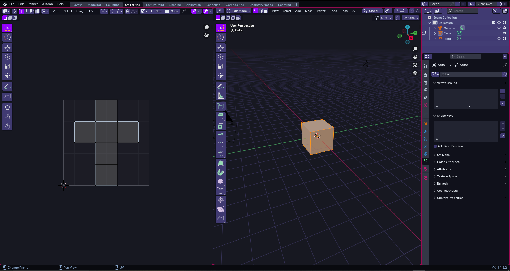
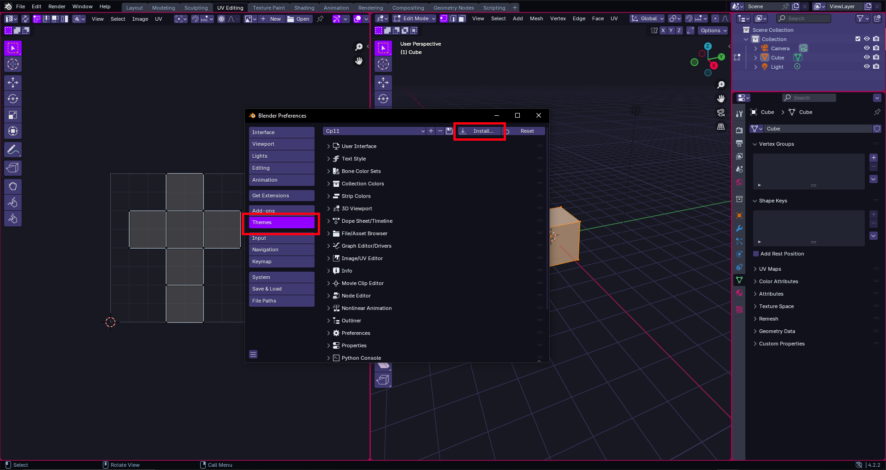

# Blossom Theme for Blender

## Preview <!---Do not chang headers (Required for WebBuilder)-->

## Installation <!---Do not chang headers (Required for WebBuilder. Keep the content text-based to avoid WebBuilder conflicts)-->

1. Download the theme  
    Get the `.xml` theme file from the source where it’s provided.

2. Open Blender  
    Launch the Blender application.

3. Go to Preferences  
    Click `Edit` > `Preferences`.

4. Navigate to Themes  
    In the Preferences window, select the `Themes` tab.

5. Install the theme  
    Click `Install`.

6. Select the theme file  
    Choose the `.xml` file and press **"Install Theme"**.

7. Done!  
    Blender automatically applies and saves the theme.

That's it... Enjoy!

## NOTE
This theme is licensed under the MIT license for GitHub distribution, as it aligns with the standard licensing used by [@BlossomTheme](https://github.com/BlossomTheme), and under the GPL-3.0-or-later license for distribution through the [Blender Extension Store](https://extensions.blender.org/approval-queue/blossom-theme/), to comply with Blender’s own GPL licensing requirements.
